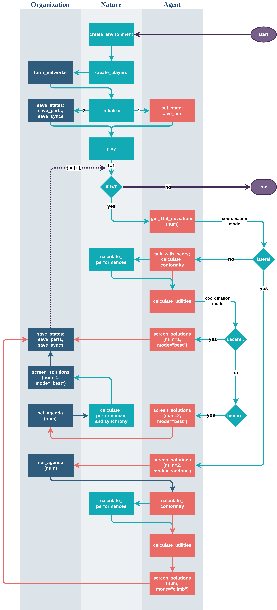

# thiNK framework for ABM

This is an agent-based simulation codebase for an organization with multiple interacting agents based on an _NK_ framework by Stuart Kauffman (1991).

### Summary
The model heavily focuses on the social norms emerging from the interactions and sharing of knowledge among agents, and thus features networks. In that regard, this model combines _NK framework_ with the _Network Theory_.

### Platform
The code is written in _Python_ using an OOP paradigm that features aggregation relationship of type `has_many` between `Organization` and `Agent` classes, and a hidden `Nature` class.

### Process overview

### Codebase and directory structure
The big part of the codebase is the _NKPackage_ that contains utility commands for the comfortable _NK_ development. The documentation for the code is not available at the moment, so it is advised to look at the comments in the code for now.

The directory `models/` contains the definitions of the aforementioned classes. The files `main.py` and `test.py` contain the particular implementation, given the parameter set. The directory `refmaterial/` contains the utilities and useful functions. The directory `nkpack` contains the newest version of the _NKPackages_.

### Performance
The `_calculate_global_maximum` method is the slowest part of the code, as it runs through every possible bitstring and maps it to a performance. At the moment, `jit` is used for its underlying `nk.calculate_performances` command under _NKPackage_. Also the `main.py` runs a `multiprocessing.Pool` for faster simulations. _CUDA_ is being considered at the moment, but without clear idea how to implement it.

### Credits
The code is written by Ravshan Hojimatov. The research was done at University of Klagenfurt, Austria between 2019 and 2024 by Ravshanbek Khodzhimatov, Stephan Leitner, and Friederike Wall.
